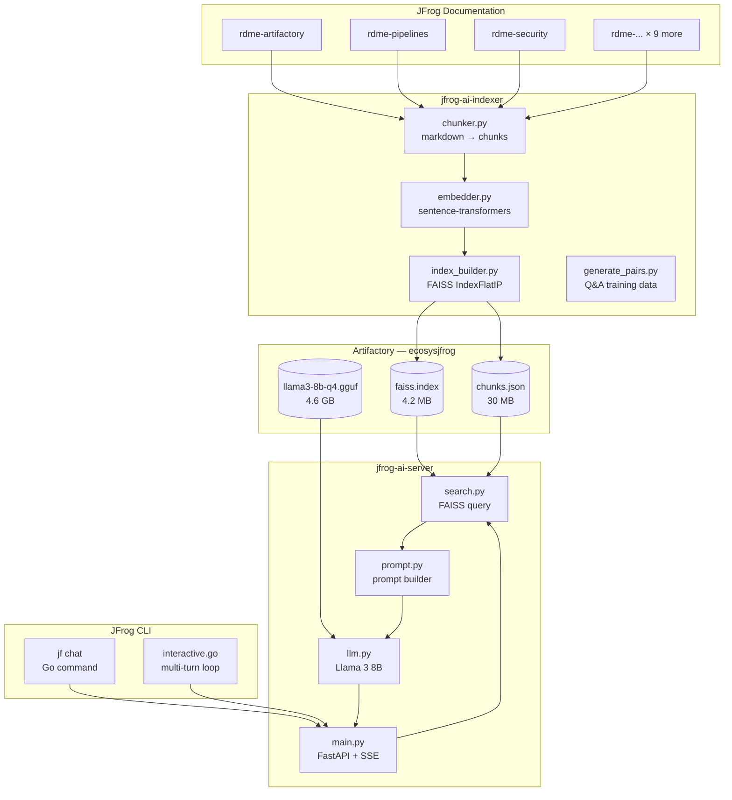
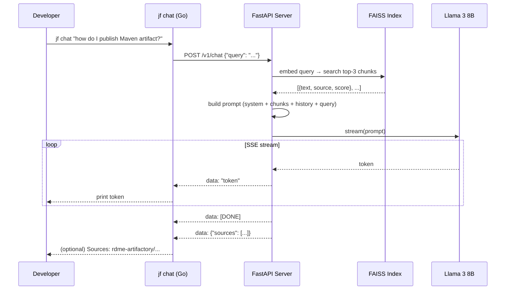
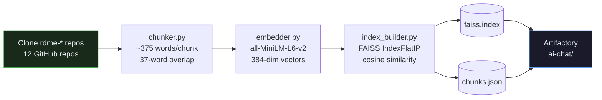
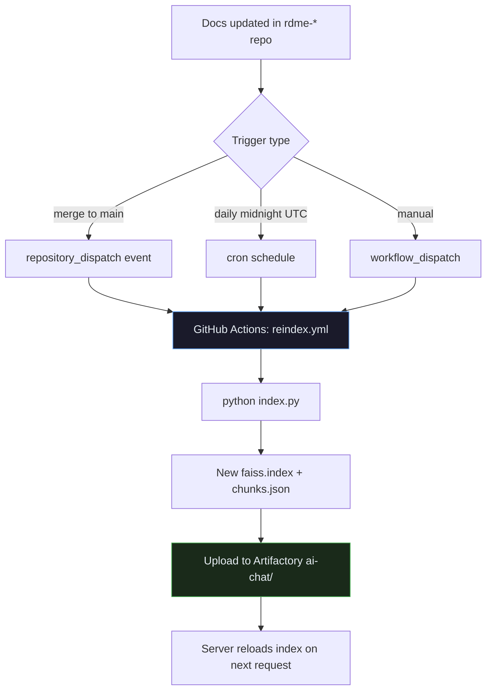
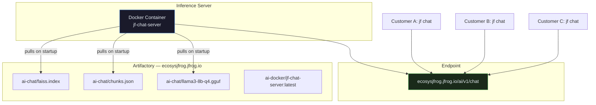

# jf chat — Architecture & Design

> AI documentation assistant for JFrog CLI. Ask any JFrog question in natural language directly from the terminal.

---

## System Overview

---

## Query Flow (per request)

---

## Indexing Pipeline

**Output:** 13,466 chunks from 12 JFrog product documentation repos.

---

## Auto-reindex Flow

---

## Deployment Architecture

---

## RAG vs Fine-tuning

| Approach | What it does | When to use |
|---|---|---|
| **RAG (current)** | Retrieves relevant doc chunks at query time, feeds to base Llama 3 | Always — keeps answers grounded in current docs |
| **Fine-tuning (v2)** | Trains model weights on 12k JFrog Q&A pairs | Improves JFrog-specific tone and accuracy |
| **RAG + Fine-tuning** | Best of both — fine-tuned model + fresh doc retrieval | Production v2 target |

---

## Cost Model

| Solution | Cost per 1M queries | Data privacy | Offline |
|---|---|---|---|
| OpenAI GPT-4o | ~$5,000–15,000 | ❌ leaves JFrog infra | ❌ |
| Anthropic Claude | ~$3,000–9,000 | ❌ leaves JFrog infra | ❌ |
| **jf chat (Llama 3 + RAG)** | **$0** | ✅ fully local | ✅ |

---

## Component Responsibilities

### jfrog-ai-indexer

| File | Responsibility |
|---|---|
| `chunker.py` | Split markdown into overlapping text chunks |
| `embedder.py` | Generate 384-dim sentence embeddings |
| `index_builder.py` | Build + save FAISS index and chunks.json |
| `uploader.py` | Upload artifacts to Artifactory |
| `index.py` | Orchestrate the full pipeline |
| `generate_pairs.py` | Generate Q&A training pairs via local LLM |

### jfrog-ai-server

| File | Responsibility |
|---|---|
| `search.py` | Load FAISS index, embed query, return top-k chunks |
| `prompt.py` | Build LLM prompt from system message + chunks + history |
| `llm.py` | Load Llama 3 GGUF, stream tokens |
| `main.py` | FastAPI app — `/v1/chat` SSE endpoint + `/health` |
| `finetune.py` | LoRA fine-tuning via Unsloth (optional, requires GPU) |

### jfrog-cli (general/chat/)

| File | Responsibility |
|---|---|
| `cli.go` | `jf chat` command entrypoint, flag parsing |
| `client.go` | HTTP POST to server, SSE stream reader |
| `interactive.go` | Multi-turn conversation loop (`--interactive`) |
| `models.go` | `ChatRequest`, `Message` types |

---

## Key Design Decisions

**Why FAISS instead of a vector database?**
FAISS index is a single file stored as an Artifactory artifact. No separate database to run or maintain. For 13k chunks it's fast enough (<10ms retrieval) and simple to update.

**Why Llama 3 8B Q4_K_M?**
~4.7GB quantized — fits in RAM, runs on CPU without GPU. Performance is sufficient for documentation Q&A where context is provided via RAG.

**Why SSE streaming?**
Token-by-token streaming gives instant feedback even for long answers. Go's `bufio.Scanner` handles SSE parsing natively without additional libraries.

**Why sentence-transformers all-MiniLM-L6-v2?**
384-dim embeddings, ~80MB model, fast CPU inference, good retrieval quality for technical documentation. Same model used in both the indexer and the server ensures embedding space consistency.
